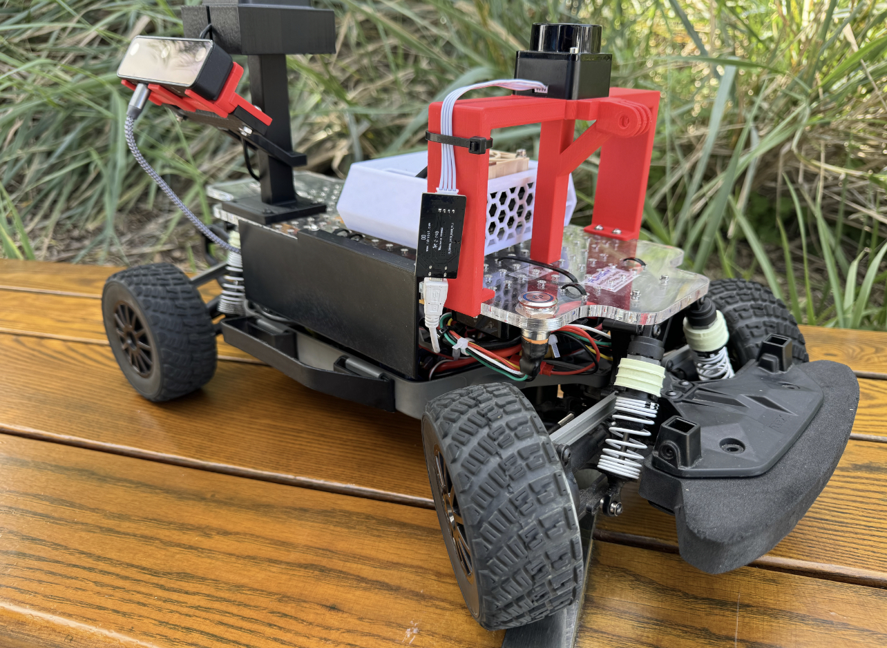

<h1 align="center">The Tank</h1>

<!-- PROJECT LOGO -->
 

  
<h3>ECE/MAE148 Final Project</h3>

Team 3 Fall 2024

<!-- TABLE OF CONTENTS -->

  
Table of Contents

  <ol>
    <li><a href="#team-members">Team Members</a></li>
    <li><a href="#final-project">Final Project</a></li>
      <ul>
        <li><a href="#original-goals">Original Goals</a></li>
          <ul>
            <li><a href="#goals-we-met">Goals We Met</a></li>
            <li><a href="#our-hopes-and-dreams">Our Hopes and Dreams</a></li>
              <ul>
                <li><a href="#stretch-goal-1">Stretch Goal 1</a></li>
                <li><a href="#stretch-goal-2">Stretch Goal 2</a></li>
              </ul>
          </ul>
        <li><a href="#final-project-documentation">Final Project Documentation</a></li>
      </ul>
    <li><a href="#robot-design">Robot Design </a></li>
      <ul>
        <li><a href="#cad-parts">CAD Parts</a></li>
          <ul>
            <li><a href="#final-assembly">Final Assembly</a></li>
            <li><a href="#custom-designed-parts">Custom Designed Parts</a></li>
            <li><a href="#open-source-parts">Open Source Parts</a></li>
          </ul>
        <li><a href="#electronic-hardware">Electronic Hardware</a></li>
        <li><a href="#software">Software</a></li>
          <ul>
            <li><a href="#embedded-systems">Embedded Systems</a></li>
            <li><a href="#ros2">ROS2</a></li>
            <li><a href="#donkeycar-ai">DonkeyCar AI</a></li>
          </ul>
      </ul>
    <li><a href="#acknowledgments">Acknowledgments</a></li>
    <li><a href="#authors">Authors</a></li>
    <li><a href="#contact">Contact</a></li>
  </ol>

<!-- TEAM MEMBERS -->
## Team Members

    
Agasthya, Harshit, Minjun, Purab

<h4>Team Member Major and Class </h4>
<ul>
  <li>Agasthya - Mechanical Engineering, Ctrls & Robotics (MC34) - Class of 2025</li>
  <li>Harshit - Mechanical Engineering, Ctrls & Robotics (MC34) - Class of 2025</li>
  <li>Minjun - Electrical Engineering (EC27) - Class of 2026</li>
  <li>Purab - Computer Engineering (EC26) - Class of 2026</li>
</ul>

<!-- Final Project -->
## Final Project

Our project goal was to develop a car that follows a set path based on GPS cordinates searching for certain objects and shooting it with a laser. We aimed to create a project that could be useful in the defense industry creating autonomus tanks and other vehicles to save lives of military personal. Our project is developed using ROS2 packages that works with the UCSD Robocar framework to be able to control the servos in charge of aiming and shooting the laser, as well as have the car run on its set path using GNSS.

<!-- Original Goals -->
### Original Goals
- Automated Path Setup
  - Develop a package dedicated to extracting the car's path, converting it to corresponding .csv datasets for route mapping and navigation.
    - Upon launch, the car will follow a path based on data obtained from the GNSS, adhering to its route.
    - Adjust the PID variables to correct overcorrection and undercorrection when the car deviates from its path.
    - Implement real-time monitoring and adjustments to ensure the car stays on course.
- Color Recognition
  - Utilize the camera to obtain a real-time view of the environment and track colors. 
    - Determine the coordinates from the center when a color is detected.
    - Once color detection is functional, work on detecting specific objects.
    - Integrate object detection algorithms to enhance the accuracy and reliability of the system.
- CAD Design
  - Design a servo mount capable of rotating along the X and Y axes.
    - Create a mount attached to the servos to enable pointing at different locations.
    - Ensure the design is robust and can withstand the operational stresses of the system.
    - Optimize the mount for ease of assembly and maintenance.
- Servo Motor Control
  - Employ the adafruit_servokit library to move the servos and aim the laser along the X and Y axes.
    - Use coordinates received from the color or object detection model to move the servo and point at the specific object.
    - Implement precise control algorithms to ensure accurate targeting.
    - Test and calibrate the servo movements to achieve optimal performance.
- Laser Control
  - Activate the laser when the object is detected and the laser is aimed at the object.
    - Ensure safety protocols are in place to prevent accidental activation.
    - Integrate feedback mechanisms to confirm successful targeting and firing.
    - Conduct thorough testing to validate the system's reliability and effectiveness.
   
<!-- End Results -->
### Goals We Met (will fix when files are uploded)
- [`ride_request_publisher.py`](src/ride_request_pkg/ride_request_pkg/ride_request_publisher.py): Automated Path Setup 
- [`user_input_interfaces`](src/user_input_interfaces/msg): Color Recognition
  - [`RideRequest.msg`](src/user_input_interfaces/msg/RideRequest.msg)
  - [`RideMatch.msg`](src/user_input_interfaces/msg/RideMatch.msg)
- [`face_rec_pkg`](src/face_rec_pkg/face_rec_pkg): CAD Design
  - [`face_publisher.py`](src/face_rec_pkg/face_rec_pkg/face_publisher.py): face recognition node for publishing identified name and video stream
- [`face_rec_pkg`](src/face_rec_pkg/face_rec_pkg): Servo Motor Control
- [`face_rec_pkg`](src/face_rec_pkg/face_rec_pkg): Laser Control

See [`README`](src/README.md) section in our `src` directory for breakdown of how our packages run together

### Our Hopes and Dreams
#### Stretch Goal 1
- Complete package integration with ROS
  - We would like to have ROS integration because it provides a modular and scalable framework for developing robotic applications. ROS allows for seamless communication between different components, enabling more robust control of the car. By integrating ROS, we can enhance the system's modularity, making it easier to implement additional features, debug issues, and ensure compatibility with other robotics projects in the future.

#### Stretch Goal 2
- LiDAR
  - Since our car is only driving using GPS, there are no object avoidance capabilities. LiDAR will allow us to detect obstacles on the path and navigate around them, returning to the GPS-defined route. Incorporating LiDAR enhances the system's situational awareness, making it more adaptable to dynamic environments. This development is inspired by existing projects like autonomous vehicles, which combine GNSS with LiDAR to achieve precision and safety.
### Final Project Documentation

* [Final Project Proposal](https://docs.google.com/presentation/d/1ciqbkGPFqllosRhsaxw-nCjrUmgzkP6osQgYeFSXA8M/edit#slide=id.g27c9638c8a0_0_194)

<!-- Early Quarter -->
## Robot Design

### CAD Parts
#### Final Assembly

#### Custom Designed Parts
| Part | CAD Model | Designer |
|------|--------------|------------|
| Front Camera Mount |  | Minjun
| Servo Mount |  | Purab
| Acrylic Base |  | Purab

### Electronic Hardware
Below is a circuit diagram of the electronic hardware setup for the car.

### Software
#### Embedded Systems
To program the Jetson Nano, we accessed the Jetson Nano through remote SSH connection to an embedded Linux system onboard and ran a docker container with all the necessary dependencies to run our packages. This allowed us to eliminate any incompatibility issues and to maximize resource efficiency on the Jetson. We used a variation of virtualization softwares including VMWare and WSL2 to build, test and launch our programs. 

#### ROS2
The base image pulled from Docker Hub for our project development contained the UCSD Robocar module ran on a Linux OS (Ubuntu 20.04). The Robocar module, consisting of several submodules using ROS/ROS2, was originally developed by Dominic Nightingale, a UC San Diego graduate student. His framework was built for use with a wide variety of sensors and actuation methods on scale autonomous vehicles, providing the ability to easily control a car-like robot while enabling the robot to simultaneously perform autonomous tasks.

#### DonkeyCar AI
For our early quarter course deliverables we used DonkeyCar to train a car in driving autonomous laps around a track in a simulated environment. We used Deep Learning to record visual data of driving on a simulated track and trained the car with the data to then race on a remote server. This helped us to prepare for training our physical car on an outdoor track with computer vision.

<!-- Authors -->
## Authors
  - [@PurabB](https://github.com/PurabB)  
  - [@MinjunSong068](https://github.com/MinjunSong068) 
  - [@AgasthyaV](https://github.com/AgasthyaV) 
  - [@hgoyal2003](https://github.com/hgoyal2003) 

<!-- Badges -->

<!-- ACKNOWLEDGMENTS -->
## Acknowledgments
*Thank you to my teammates, Professor Jack Silberman, and our incredible TA's Winston and Alexander for an amazing Fall 2024 class!*

<!-- CONTACT -->
## Contact

* Agasthya | avalluri@ucsd.edu
* Harshit  | hgoyal@ucsd.edu 
* Minjun   | mis034@ucsd.edu
* Purab    | pbalani@ucsd.edu

